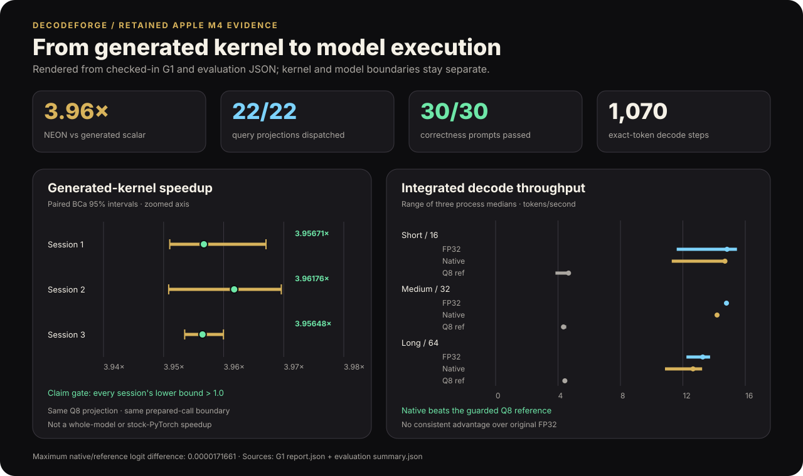
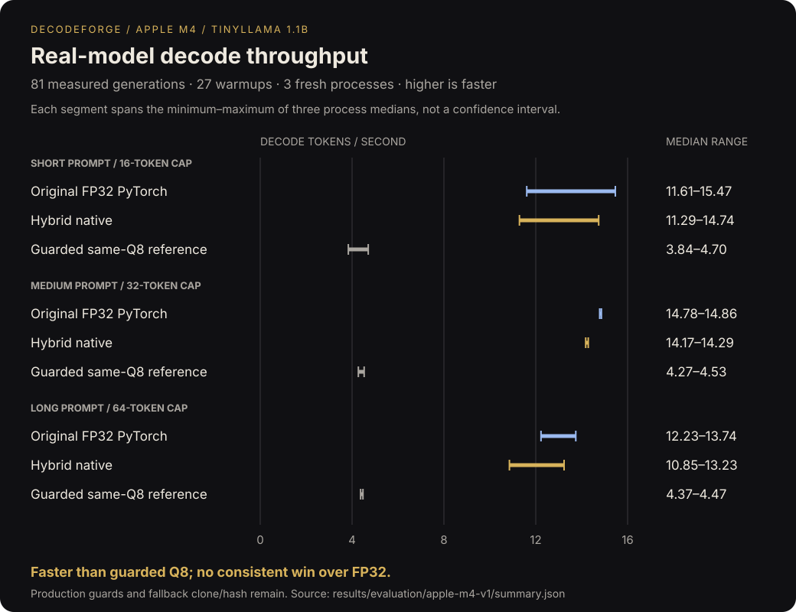

# DecodeForge

[](https://github.com/maxmagidin/decodeforge/actions/workflows/ci.yml)
[](LICENSE)
[](Cargo.toml)
[](pyproject.toml)

**A Rust compiler that turns quantized LLM projections into ARM64 NEON kernels
and runs them inside PyTorch.**

DecodeForge compiles one operation inside TinyLlama: the query projection that
helps attention process each new token. It specializes a fixed shape and loop
schedule for Apple M4, generates scalar or ARM64 NEON C, checks the compiled
library, and calls it from PyTorch.

During cached single-token decode, generated code handles the `q_proj` module
in every one of TinyLlama's 22 transformer layers. The repository keeps the
generated source, machine-code checks, raw timing samples, model results, and
offline verifiers behind that claim.

> **Headline result:** generated NEON was approximately **3.96× faster** than
> generated scalar across three independent Apple M4 sessions at the same-Q8
> prepared-call boundary. This is a kernel result—not a 3.96× whole-model or
> stock-PyTorch speedup.

[Read the plain-language primer](docs/PRIMER.md) ·
[Inspect the results](results/README.md) ·
[Understand the design](docs/DESIGN.md) ·
[Try it](#try-it)

## Results at a glance

| Measurement | Result | Evidence |
| --- | ---: | --- |
| Generated NEON vs generated scalar | **3.956×–3.962×** across 3 independent sessions | [G1 kernel result](results/g1/apple-m4-primary/README.md) |
| Native vs same-Q8 model behavior | **30/30 prompts**, **1,070 generated tokens**, exact token agreement | [Apple M4 evaluation](results/evaluation/apple-m4-v1/README.md) |
| Maximum native/reference logit difference | **0.0000171661** | [Correctness capture](results/evaluation/apple-m4-v1/correctness-v1.json) |
| Native execution coverage | **22/22** query projections across **1,040 cached steps** and **22,880 native calls** | [Correctness capture](results/evaluation/apple-m4-v1/correctness-v1.json) |
| Q8 vs original FP32 sensitivity | **99.7099%** next-token argmax agreement on 1,034 fixed tokens | [Evaluation summary](results/evaluation/apple-m4-v1/summary.json) |
| Reproducible model benchmark | **81 measured generations + 27 warmups** across 3 fresh processes | [Evaluation protocol](docs/EVALUATION_V1.md) |

The kernel improvement did not produce a consistent model speedup over original
FP32 PyTorch. Model timing also includes the adapters, runtime checks, and all
the operations that remain in PyTorch.



## Try it

You do not need TinyLlama weights to verify the saved results. After installing
the [prerequisites](CONTRIBUTING.md#prerequisites):

```sh
git clone https://github.com/maxmagidin/decodeforge.git
cd decodeforge
make setup
make verify-g1-result verify-g3-result verify-evaluation-result
```

The three commands end with `verify-g1-result: ok`, `g3-verification: ok`, and
`evaluation-summary-verification: ok`. They recompute or validate the retained
evidence; they do not rerun the model.

Run the complete development suite with `make check`. A new local generation
needs the pinned TinyLlama/tokenizer files and prepared Q8 assets; follow the
[presentation guide](docs/PRESENTATION_DEMO.md) when you want to cross that
heavier boundary.

## What DecodeForge builds

```text
fixed TinyLlama q_proj weights + static [N,K] + Apple M4 target
                              │
                              ▼
                    exact DFQ8_B32_V1 semantics
                              │
                              ▼
                     typed Region IR + Loop IR
                              │
                              ▼
                   output-interleaved OI4 packing
                              │
                              ▼
              deterministic scalar / ARM64 NEON C
                              │
                              ▼
             Clang build + machine-code validation
                              │
                              ▼
              versioned runtime ABI + guarded ownership
                              │
                              ▼
                   eager PyTorch q_proj adapters
                       ┌──────┴────────┐
                       ▼               ▼
             same-Q8 prefill     native M=1 decode
                       └──────┬────────┘
                              ▼
               correctness + timing + lifecycle evidence
```

PyTorch and Transformers still own model loading, tokenization, attention, KV
state, sampling, and every unsupported operation. DecodeForge replaces only the
eligible query-projection work it can guard and verify.

## What “22 query projections” means

TinyLlama has 22 transformer layers, and each layer has one `q_proj` linear
operation that builds the attention query for the current token. DecodeForge
replaces that one operation in all 22 layers during cached decode. It does not
replace an entire transformer layer: key, value, and output projections, the
MLP, attention, and prompt prefill remain in PyTorch or the same-Q8 reference.

## Inside the compiler

The compiler represents the operation, chooses its memory layout and loop
structure, and generates the code:

- **Typed IR:** Region and Loop IR keep operator semantics separate from the
  execution schedule, vector width, reduction order, tails, and packed offsets.
- **Deterministic lowering:** the same versioned request and weights produce
  byte-stable source and artifacts tied to their inputs by hashes.
- **Generated code:** the compiler emits strict scalar and ARM64 NEON C rather
  than calling an existing matrix-multiplication primitive.
- **Verified packing:** OI4 packing aligns memory with output-lane
  vectorization while preserving the same quantized weights.
- **Machine-code validation:** compiled modules are checked for architecture,
  symbols, relocations, helpers, stack behavior, and expected instruction forms
  before loading. This is an automated contract check, not a third-party
  security audit or a formal proof.
- **Guarded execution:** versioned C ABIs validate shapes, buffer extents,
  features, artifact identities, ownership, and lifecycle state.
- **Reproducible measurements:** correctness gates run before timing; raw
  observations, failed runs and their reasons, specifications, and analyzers
  remain checked in.

The generated module specializes the shape and schedule; separately identified
weight packs supply the actual values. DecodeForge controls the loops, layout,
and numerical contract, while Clang performs instruction selection and register
allocation.

Follow the implementation from [IR](compiler/decodeforge-compiler/src/ir.rs)
to [packing](compiler/decodeforge-compiler/src/pack.rs),
[NEON generation](compiler/decodeforge-compiler/src/codegen/neon_c.rs),
[artifact validation](compiler/decodeforge-compiler/src/native/audit.rs), the
[native bridge](compiler/decodeforge-bridge/src/lib.rs), and the
[PyTorch model adapter](python/decodeforge/qproj_model.py).

## Measured Apple M4 behavior

### Generated kernel

G1 compares generated scalar and generated NEON code for the same
`M=1, N=2048, K=2048` Q8 projection through the same allocation-free
prepared-call boundary. Each of three processes ran 40 balanced scalar/NEON
pairs after warmup and calibration. A deterministic 10,000-resample paired BCa
bootstrap produced one 95% interval per session; every lower bound exceeded the
predeclared 1.0 gate.

| Session | Paired speedup | 95% paired-BCa interval |
| --- | ---: | ---: |
| 1 | 3.95671× | [3.95103, 3.96705] |
| 2 | 3.96176× | [3.95085, 3.96960] |
| 3 | 3.95648× | [3.95351, 3.95997] |

The timed boundary includes output-sentinel fill, the generated-module ABI
call, status decoding, and a finite-output scan. It excludes packing,
compilation, dynamic loading, and allocation.

### Integrated model

Decode throughput is reported in tokens/second. Each range spans the three
per-process medians, not a confidence interval or selected best runs.



| Case / output cap | Original FP32 PyTorch | Hybrid native | Guarded same-Q8 reference |
| --- | ---: | ---: | ---: |
| Short / 16 | 11.61–15.47 | 11.29–14.74 | 3.84–4.70 |
| Medium / 32 | 14.78–14.86 | 14.17–14.29 | 4.27–4.53 |
| Long / 64 | 12.23–13.74 | 10.85–13.23 | 4.37–4.47 |

Production guards remained enabled. Correctness-comparison hooks were excluded
from performance timing, but the guarded reference path still includes its own
weight clone/hash work, and outer finite-logit checks remain. Only query
projections use native decode; the rest of the model stays in PyTorch.

For the full numerical, lifecycle, setup, memory, and limitations record, read
the [Apple M4 evaluation](results/evaluation/apple-m4-v1/README.md).

## Repository guide

| Path | Responsibility |
| --- | --- |
| [`compiler/decodeforge-core`](compiler/decodeforge-core) | Exact Q8 semantics, identities, and fixture contracts |
| [`compiler/decodeforge-compiler`](compiler/decodeforge-compiler) | Typed IR, lowering, OI4 packing, source generation, toolchain and artifact validation |
| [`compiler/decodeforge-runtime`](compiler/decodeforge-runtime) | Generated-module validation, ownership, loading, and execution |
| [`compiler/decodeforge-bridge`](compiler/decodeforge-bridge) | Hardened process-local C ABI over verified modules and packs |
| [`python/decodeforge`](python/decodeforge) | Evidence tooling, eager PyTorch binding, query-projection adapters, evaluation |
| [`benchmarks`](benchmarks) | Frozen experiment specifications and capture inputs |
| [`results`](results) | Checked-in raw observations, summaries, generated source, and audits |
| [`schemas`](schemas) | Closed JSON contracts and stable diagnostics |
| [`docs`](docs) | Design, methods, decisions, project narrative, and reproduction guides |

Additional navigation is available in the
[compiler](compiler/README.md), [Python](python/README.md),
[benchmark](benchmarks/README.md), [results](results/README.md), and
[documentation](docs/README.md) indexes.

## Scope and limitations

The completed G0–G3 path is intentionally narrow:

- Apple M4 / ARM64 NEON;
- one thread;
- frozen, bias-free `DFQ8_B32_V1` weights;
- static `M=1, N=2048, K=2048` native query projections;
- all 22 TinyLlama `q_proj` modules during cached decode;
- eager PyTorch integration rather than a general FX or `torch.compile`
  backend.

The remaining 133 TinyLlama linear modules, native prefill, schedule search,
x86-64 AVX2, fusion, multicore execution, and general graph compilation are
not implemented. The current evidence comes from one physical M4 and a
synthetic 30-prompt corpus; it establishes implementation agreement and a
repeatable kernel result, not general model quality or cross-host performance.

This scope lets each benchmark measure a specific part of the system.

## Documentation

The [documentation map](docs/README.md) separates the plain-language tour,
current technical contracts, reproduction guides, and historical project
record.

## Status and next work

The original G0–G3 path is complete:

- **G0:** independent Python/Rust Q8 semantics and a provenance-bound corpus;
- **G1:** typed IR, OI4 packing, deterministic scalar/NEON generation, validated
  native artifacts, and the retained M4 kernel result;
- **G2:** a hardened native ABI and guarded eager PyTorch operator;
- **G3:** all-22 TinyLlama query-projection execution with retained model
  correctness, dispatch, lifecycle, and timing evidence.

The next optimization should be selected from profiling rather than feature
count: reduce guard/prefill overhead, broaden native linear coverage, add
schedule selection, reproduce on another physical Mac, or implement the
deferred AVX2 target.

DecodeForge's original code is licensed under [Apache 2.0](LICENSE).
Third-party dependencies and model artifacts retain their own licenses.
